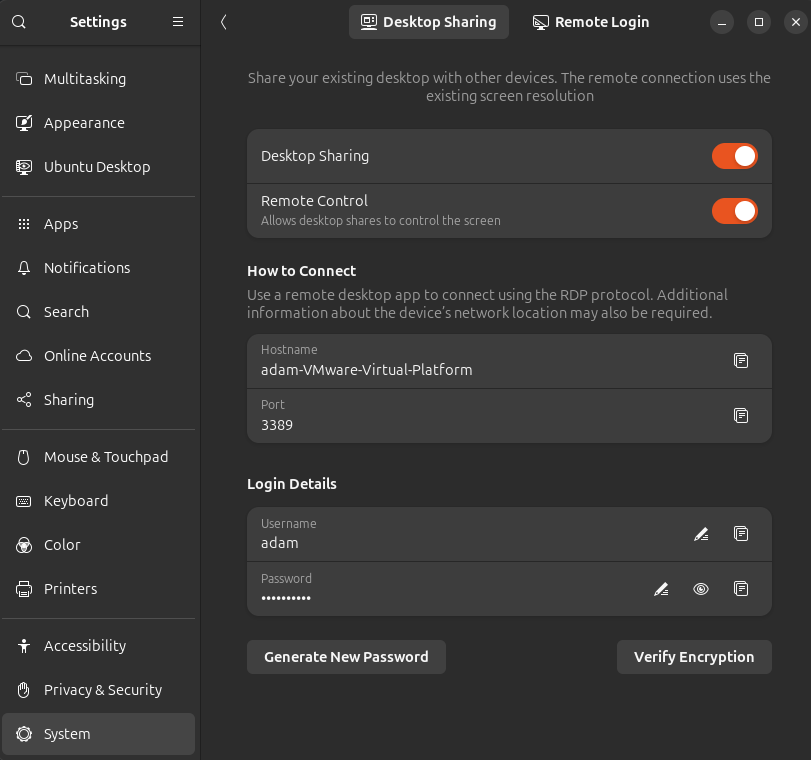

# Linux Learning Guide
> **Target Environment:** Ubuntu Desktop 24.04.3 LTS  

> **Scope:** This guide is intended for setting up a localhost environment. It does **not** cover installing or configuring publicly exposed services.

> **Prepared for:** Individuls known to me and is not be shared beyond me and that individual.
---

# Wana chat?
[Discord Server](https://discord.gg/mGGZdfsera)

---

## 📑 Table of Contents
1. [Beginner Resources](#-beginner-resources--tools)
2. [Package Manager (apt)](#package-manager-apt)
3. [Installation Scripts](#️-installation-scripts)
   - [Available Bash Scripts](#available-bash-scriptsexercises)
   - [Remote Assistance Installation](#remote-assistance-installation)
   - [Uninstall All VPN's](#uninstall-all-vpns)
4. [Linux Drive Management](#-linux-drive-management)
5. [Docker](#-docker)
   - [Official Documentation](#official-documentation)
   - [Docker Compose Commands](#docker-compose-commands)
   - [Docker Container Commands](#docker-container-commands)
   - [Docker Volume Commands](#docker-volume-commands)
   - [Docker Network Commands](#docker-network-commands)
6. [Portainer](#-portainer)
7. [Plex Media Server](#-plex-media-server)
8. [Nextcloud (Basic Install)](#-nextcloud-basic-install)
9. [Traefik (Reverse Proxy & Load Balancer)](#-traefik-reverse-proxy--load-balancer)
10. [Getting started with GitHub](#-getting-started-with-github)
11. [Essential Linux Troubleshooting](#%EF%B8%8F-essential-linux-troubleshooting)
12. [AI Fun](#ai-fun)

---

## 📖 Beginner Resources & Tools
- [VMWare WorkstationPro FREE (Sign up required)](https://support.broadcom.com/group/ecx/productdownloads?subfamily=VMware%20Workstation%20Pro&freeDownloads=true)
- [Balena Etcher USB Imager](https://etcher.balena.io)
- [Ubuntu Desktop Install Guide](https://ubuntu.com/tutorials/install-ubuntu-desktop#1-overview)
- [Useful Linux Command Reference (Hostinger)](https://www.hostinger.com/tutorials/linux-commands)
- [Linux Journey - Basic Concepts](https://linuxjourney.com/)
- [Command Lookup](https://explainshell.com/)
- [Chmod Calvulator](https://chmod-calculator.com/)

---

## Package Manager (apt)

The **apt** package manager is the primary tool for installing, updating, and managing software on Ubuntu and most Debian-based Linux systems. Understanding how to use apt will help you maintain your system, install new tools, and keep everything up-to-date.

### Common apt Commands

- **Update package lists**
  ```bash
  sudo apt update
  ```
  Refreshes your local index of available software packages.

- **Upgrade installed packages**
  ```bash
  sudo apt upgrade
  ```
  Installs the latest versions of all packages currently installed.

- **Install a package**
  ```bash
  sudo apt install <package-name>
  ```
  Installs a new package (example: `sudo apt install htop`).

- **Remove a package**
  ```bash
  sudo apt remove <package-name>
  ```
  Removes a package but leaves its configuration files.

- **Purge a package**
  ```bash
  sudo apt purge <package-name>
  ```
  Removes a package and its configuration files.

- **Search for packages**
  ```bash
  apt search <keyword>
  ```
  Lists available packages matching your keyword.

- **Show package details**
  ```bash
  apt show <package-name>
  ```
  Displays detailed information about a package.

- **List upgradable packages**
  ```bash
  apt list --upgradable
  ```

- **Clean the apt cache**
  ```bash
  sudo apt clean
  ```
  Frees up space used to store packages after installation.

### Useful Tips

- Always run `sudo apt update` before installing new software to ensure you have the latest repositories.
- Use `apt list --installed` to see all installed packages.
- You can combine `update` and `upgrade`:
  ```bash
  sudo apt update && sudo apt upgrade
  ```
- For advanced management tasks, see the [Apt User Guide](https://help.ubuntu.com/community/AptGet/Howto).

---

## ⚙️ Installation Scripts
This repository includes several helpful automated installation scripts amoung other things.
I will continue to add to this as this grow in to a more comprehensive knowledge space.

## ⚙️ Bash Exercise Scripts
I have inlcuded in /bash_exercises/* some basic scripts that can show you some basic syntax. 

### Available Bash Scripts/Exercises
```bash
# Bash excercises.
/bash_exercises/* #All the scripts in this location are basic excersises, see comments for what they do.

# Software Installs.
./sublime_install.sh #Installs sublime-text and sublime-merge
./chrome_install.sh #Install chrome.
./docker_install.sh #Install dcoker.
./install_flatpak.sh #An addtional software store, more apps on top of the standard ubuntu store.

# Combined installer docker, word press within docker.
./docker-compose/wordpress_install.sh #Self contained install script for running wordpress within docker.

# Github related.
./git_setup.sh #Installs git gh with guided authentication.
./git_push_changes.sh #Push changes to github.

# VPN related scripts
./new_vpn.sh #Installs ZeroTier VPN and adds you to the Linux Learn Network. Will automatically remove Nord/Hamachi.
./remove_all_vpn.sh #This will remove any installed vpn technologies on your machine. Nord/Hamachi/ZeroTier.
/zerotier_tools/get_ip.sh # Will output to terminal Usage: ./get_ip.sh <api_token> <network_id>
/zerotier_tools/html_ip.sh # Will output to html file, Usage: ./html_ip.sh <api_token> <network_id>

# Still required but now obsolete.
./deprecated/hamachi_install.sh #DO NOT USE
./deprecated/uninstall_hamachi.sh #DO NOT USE
./deprecated/install_remote_assist.sh #DO NOT USE
./deprecated/uninstall_remote_assist.sh # #DO NOT USE
.deprecated/reconnect.sh # #DO NOT USE
```

### ⚙️ Main functions
All the main functions across all the scripts are inside the below. You can add addtional functions in to here to call them globally.
```bash
/includes/main.php
```
You can add this top your scripts by adding this line.

```bash
source includes/main.sh
```

### Remote Assistance Installation

To add your VM to the linux learn network (faciliated by ZeroTier VPN) run the below script. Once you have enable remote desktop on your machine it will allow us to remote assist each others machines.

```bash
./new_vpn.sh
```
Dont worry about romoving any of the old methods, the script will handle this. 

You will still need to leave remote desktop enabled in: Settings > System > Renote Desktop. As below:

s

### Uninstall All VPN's

You can remove all VPN technologies from your machine using the below script. It will remove nordvpn, logmein-hamachi and zerotier-one. You can then turn off the rmeote desktop features as above.

```bash
./remove_all_vpn.sh
```

---

## 💾 Linux Drive Management
- [Formatting Disks](https://phoenixnap.com/kb/linux-format-disk)
- [Mounting Disks](https://www.wikihow.com/Linux-How-to-Mount-Drive)
- [Linux Software RAID (mdadm)](https://www.ricmedia.com/tutorials/create-a-linux-raid-array-using-mdadm)
- [Disable USB Storage Quirk](https://forums.unraid.net/topic/170412-unraid-61210-how-to-permanently-add-a-usb-storage-quirk-to-disable-uas/)

---

## 🐳 Docker
Basic Docker commands for managing containers, volumes, and networks. Future updates may include `docker-compose` files for building services.

### Official Documentation
- [Docker Docs](https://docs.docker.com)

### Docker Compose Commands
```bash
docker compose up -d   # Start containers in detached mode
docker compose down    # Stop and remove containers
```

### Example docker.compose.yml and .env
Example files can be found in:
```bash
docker-compose/docker-compose.yml
docker-compose/.env
```

### Docker Container Commands
```bash
sudo docker container [command]
```
Common commands include:
- `attach` – Connect to a running container
- `exec` – Execute a command in a container
- `logs` – View container logs
- `ls` – List running containers
- `restart` – Restart containers
- `run` – Create & run a new container
- `stop` – Stop containers
- `rm` – Remove containers

### Docker Volume Commands
```bash
sudo docker volume [command]
```
- `create` – Create a volume
- `inspect` – Show details
- `ls` – List volumes
- `prune` – Remove unused volumes
- `rm` – Delete volumes

### Docker Network Commands
```bash
sudo docker network [command]
```
- `create` – Create a network
- `connect` – Attach a container to a network
- `disconnect` – Remove a container from a network
- `inspect` – View details
- `ls` – List networks
- `prune` – Remove unused networks
- `rm` – Delete networks

---

## 🔧 Portainer
- [Portainer Website](https://www.portainer.io/)
- [Install Guide (Docker/Linux)](https://docs.portainer.io/start/install/server/docker/linux)

⚠️ Docker must be installed and running before installing Portainer.

---

## 🎥 Plex Media Server
You can run Plex Media Server inside Docker. Adjust the provided `docker-compose.yml` to fit your setup.

- [Plex Docker Hub (LinuxServer.io)](https://hub.docker.com/r/linuxserver/plex)

---

## ☁️ Nextcloud (Basic Install)
Instructions for running a basic Nextcloud instance (without Traefik or Cloudflare configuration):

- [Nextcloud All-in-One Install Guide](https://nextcloud.com/blog/how-to-install-the-nextcloud-all-in-one-on-linux/)

---

## 🔀 Traefik (Reverse Proxy & Load Balancer)
Recommended learning order:

1. [Introduction](https://doc.traefik.io/traefik/)
2. [Core Concepts](https://doc.traefik.io/traefik/getting-started/concepts/)
3. [FAQ](https://doc.traefik.io/traefik/getting-started/faq/)
4. [Configuration Overview](https://doc.traefik.io/traefik/getting-started/configuration-overview/)
5. [Providers Overview](https://doc.traefik.io/traefik/providers/overview/)
6. [Docker Provider](https://doc.traefik.io/traefik/providers/docker/)
7. [Quick Start Guide](https://doc.traefik.io/traefik/getting-started/quick-start/)

---

## 🔀 Getting started with GitHub
Recommended learning order:

1. [About GitHub](https://docs.github.com/en/get-started/start-your-journey/about-github-and-git)
2. [Start your Journey](https://docs.github.com/en/get-started/start-your-journey)
3. [Setting up git](https://docs.github.com/en/get-started/git-basics/set-up-git)
4. [Quick Start for Repositories](https://docs.github.com/en/repositories/creating-and-managing-repositories/quickstart-for-repositories)
5. [Managing Files](https://docs.github.com/en/repositories/working-with-files/managing-files)

---

## 🛠️ Essential Linux Troubleshooting

Troubleshooting is an essential skill for any Linux user. This section covers common techniques and tools to help diagnose and fix issues effectively.
Mastering these troubleshooting basics will greatly improve your ability to maintain and fix your Linux system efficiently.

---

### Common Command-Line Pitfalls

- Misspelled commands or options — use `command --help` to verify syntax.
- Permissions errors — check file ownership and permissions with `ls -l`.
- Incorrect environment variables — verify with `echo $VARIABLE_NAME`.
- Path issues — confirm executable locations using `which <command>`.

---

### Reading and Understanding Log Files

System logs provide valuable insights into system behavior and errors.

- View system logs with:
  ```bash
  sudo less /var/log/syslog
  ```
- Use the journalctl command for systemd-based logging:
  ```bash
  sudo journalctl -xe
  ```
- Check specific service logs, e.g., for SSH:
  ```bash
  sudo journalctl -u ssh
  ```

---

### System Resource Monitoring Tools

Monitor system health and resource usage in real-time or snapshots:

- `top` — Interactive process viewer.
- `htop` — Enhanced version of top (install with `sudo apt install htop`).
- `free -h` — Display memory usage.
- `df -h` — Show disk space usage.
- `du -sh <directory>` — Show size of a directory.
- `ps aux` — List all running processes.
- `kill <pid>` or `kill -9 <pid>` — Terminate a process by PID.

---

### Network Troubleshooting

Diagnose connectivity and networking issues with these commands:

- `ping <hostname/ip>` — Test network reachability.
- `traceroute <hostname>` — Trace the route packets take.
- `netstat -tuln` or `ss -tuln` — Show listening ports and connections.
- `nc -zv <host> <port>` — Check if a port is open.
- `ip addr` — Display IP addresses and interfaces.
- `ifconfig` (deprecated but still useful) — View network interfaces.

---

### Additional Tips

- Use `dmesg` to view kernel messages, useful for hardware-related issues:
  ```bash
  dmesg | less
  ```
- Restart services to apply changes or clear stuck states:
  ```bash
  sudo systemctl restart <service-name>
  ```
- When in doubt, Google error messages or check Linux community forums.

---
## AI Fun
I have written a bash script that alows you to send JSON prompts to perplexity.ai you will need an API key.
```bash
# Usage: ./perplex.sh <Perplexity API Key>
/ai_fun/./perplex.sh
```
When you run this you will be prompted to enter your query or copy in your query. 
Once finished return to a new line and type EOF and hit return again.
Wait for the response, which will be rendered in the terminal in markdown.
You will then be asked if you want to to export to an .md file.


✅ This guide is a **work-in-progress**. Contributions and improvements are welcome!

⚠️ Once we have been through all this, I will put some more together.