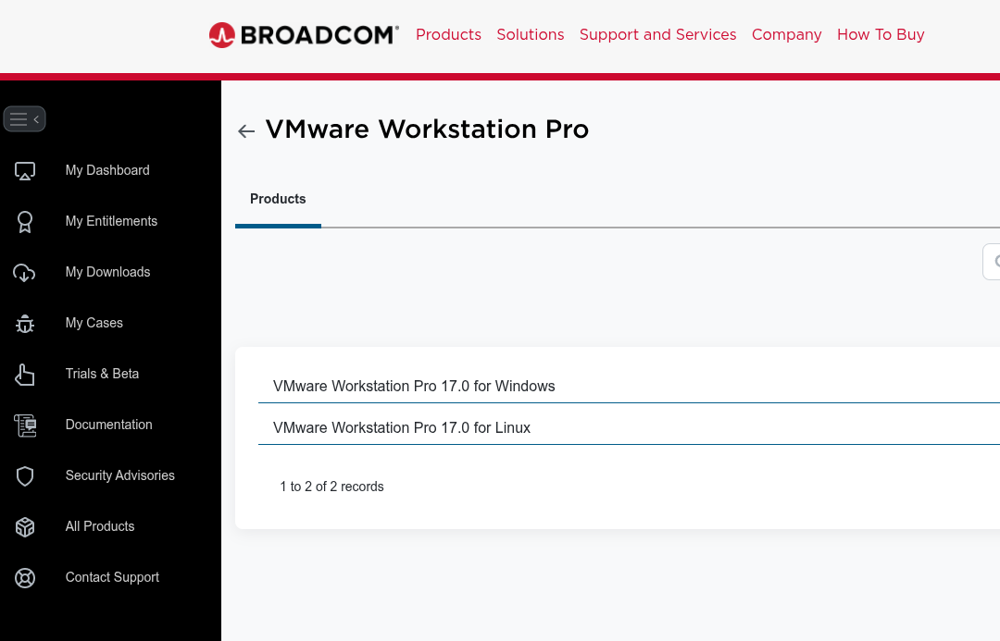
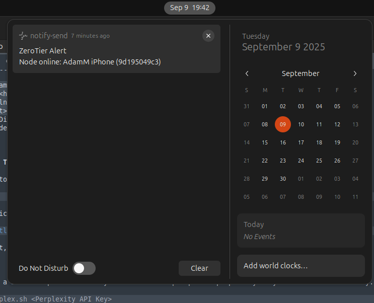

# Linux Learning Guide


> **Target Environment:** Ubuntu Desktop 24.04.3 LTS  
> **Scope:** This guide is intended for setting up a localhost environment. It does **not** cover installing or configuring publicly exposed services.  
> **Prepared for:** Individuals known to me and is not to be shared beyond me and that individual.

---

## 🚀 Quick Navigation
- 🏁 [New User Start Here](#-quick-start)
- 📋 [Prerequisites](#-prerequisites)
- ⚙️ [Installation Scripts](#%EF%B8%8F-installation-scripts)
- 🆘 [Troubleshooting](#%EF%B8%8F-essential-linux-troubleshooting)
- 💬 [Community Support](#-community-support)

---

## 📑 Table of Contents
1. [Beginner Resources & Tools](#-beginner-resources--tools)
2. [Package Manager (apt)](#-package-manager-apt)
3. [Installation Scripts](#%EF%B8%8F-installation-scripts)
4. [Linux Drive Management](#-linux-drive-management)
5. [Docker](#-docker)
   - [Official Documentation](#official-documentation)
   - [Docker Compose Commands](#docker-compose-commands)
   - [Docker Container Commands](#docker-container-commands)
   - [Docker Volume Commands](#docker-volume-commands)
   - [Docker Network Commands](#docker-network-commands)
6. [Portainer](#-portainer)
7. [Plex Media Server](#-plex-media-server)
8. [Nextcloud (Basic Install)](#%EF%B8%8F-nextcloud-basic-install)
9. [Traefik (Reverse Proxy & Load Balancer)](#-traefik-reverse-proxy--load-balancer)
10. [Getting Started with GitHub](#-getting-started-with-github)
11. [Essential Linux Troubleshooting](#%EF%B8%8F-essential-linux-troubleshooting)
12. [AI Integration Tools](#-ai-integration-tools)
13. [ZeroTier Network Tools](#-zerotier-network-tools)
14. [Utility Tools](#-utility-tools)

---

## 📖 Beginner Resources & Tools
- [VMware Workstation Pro FREE (Sign up required)](https://support.broadcom.com/group/ecx/productdownloads?subfamily=VMware%20Workstation%20Pro&freeDownloads=true)
- [Balena Etcher USB Imager](https://etcher.balena.io)
- [Ubuntu Desktop Install Guide](https://ubuntu.com/tutorials/install-ubuntu-desktop#1-overview)
- [Useful Linux Command Reference (Hostinger)](https://www.hostinger.com/tutorials/linux-commands)
- [Linux Journey - Basic Concepts](https://linuxjourney.com/)
- [Command Lookup](https://explainshell.com/)
- [Chmod Calculator](https://chmod-calculator.com/)

### VMWare Workstation Pro FREE

Once logged in go to https://support.broadcom.com/group/ecx/free-downloads then search for "VMware Workstation Pro".



---

## 🏁 Quick Start

### New to Linux? Start here:
1. **Clone this repository:**
```

sudo apt update
sudo apt install -y gh
git config --global user.name "GIT_HUB_USERNAME"
git config --global user.email "GIT_HUB_EMAIL"
gh auth login --hostname github.com --web
gh repo clone amatson97/lv_linux_learn
cd lv_linux_learn

```

2. **Make scripts executable:**
```

chmod +x scripts/*.sh
chmod +x includes/*.sh
chmod +x *.sh

```

3. **Run the installation menu:**
```

./menu.sh

# Beta desktop GUI version of this menu can be run via
./menu.py

```

4. **Follow the [Beginner Resources](#-beginner-resources--tools)** section for foundational learning.

---

## 📋 Prerequisites

### System Requirements
- **OS:** Ubuntu Desktop 24.04.3 LTS (recommended)
- **RAM:** Minimum 4GB, 8GB+ recommended for Docker containers
- **Storage:** 20GB+ free space for tools and containers
- **Network:** Internet connection for package downloads

### Required Permissions
- **Sudo access:** Required for package installation and system configuration
- **User account:** Must be in the `docker` group (script will configure this)

## Repository Structure

```
lv_linux_learn/
├── ai_fun/                            # AI integration tools and desktop applications
│   ├── perplex.sh                     # Command-line Perplexity AI client
│   └── python/                        # Python-based AI desktop applications
│       ├── assets/                    # Desktop integration files (icons, .desktop)
│       ├── generated_md_files/        # AI-generated documentation examples
│       └── perplexity_desktop_*.py    # Desktop GUI versions (v1.0-v1.4)
├── bash_exercises/                    # Basic bash scripting examples and exercises
│   ├── count_lines.sh                 # Text processing examples
│   ├── simple_calculator.sh           # Basic arithmetic operations
│   └── *.txt                          # Sample data files for exercises
├── deprecated/                        # Legacy VPN tools (Hamachi-based)
│   └── *.sh                           # Old installation/removal scripts
├── docker-compose/                    # Docker configuration examples
│   ├── docker-compose.yml             # Multi-service container setup
│   └── wordpress_install.sh           # WordPress deployment script
├── images/                            # Documentation screenshots and assets
│   ├── remote_settings.png            # Remote desktop configuration
│   └── zt_notifications.png           # ZeroTier notification examples
├── includes/                          # Shared functions and utilities
│   └── main.sh                        # Global function library for all scripts
├── scripts/                           # Main installation and setup scripts
│   ├── docker_install.sh              # Docker engine installation
│   ├── new_vpn.sh                     # ZeroTier VPN setup
│   ├── git_*.sh                       # Git workflow automation
│   └── *_install.sh                   # Various software installation scripts
├── tools/                             # File management and conversion utilities
│   ├── 7z_extractor*.sh               # Archive extraction with RAM disk support
│   ├── extract-xiso/                  # Xbox ISO extraction tool (compiled)
│   ├── flac_to_mp3.sh                 # Audio format conversion
│   └── convert_*.sh                   # Various file format converters
├── zerotier_tools/                    # VPN network management and monitoring
│   ├── get_ip.sh                      # Network member IP discovery
│   ├── html_ip.sh                     # Generate network status reports
│   └── zt_notifications.sh            # Desktop notifications for network changes
├── menu.py                            # Python-based interactive installation menu
├── menu.sh                            # Bash-based interactive installation menu
└── README.md                          # This documentation file
```


## 📦 Package Manager (apt)

The **apt** package manager is the primary tool for installing, updating, and managing software on Ubuntu and most Debian-based Linux systems. Understanding how to use apt will help you maintain your system, install new tools, and keep everything up-to-date.

### Common apt Commands

- **Update package lists**
```

sudo apt update

```
Refreshes your local index of available software packages.

- **Upgrade installed packages**
```

sudo apt upgrade

```
Installs the latest versions of all packages currently installed.

- **Install a package**
```

sudo apt install <package-name>

```
Installs a new package (example: `sudo apt install htop`).

- **Remove a package**
```

sudo apt remove <package-name>

```
Removes a package but leaves its configuration files.

- **Purge a package**
```

sudo apt purge <package-name>

```
Removes a package and its configuration files.

- **Search for packages**
```

apt search <keyword>

```
Lists available packages matching your keyword.

- **Show package details**
```

apt show <package-name>

```
Displays detailed information about a package.

- **List upgradable packages**
```

apt list --upgradable

```

- **Clean the apt cache**
```

sudo apt clean

```
Frees up space used to store packages after installation.

### Useful Tips

- Always run `sudo apt update` before installing new software to ensure you have the latest repositories.
- Use `apt list --installed` to see all installed packages.
- You can combine `update` and `upgrade`:
```

sudo apt update \&\& sudo apt upgrade

```
- For advanced management tasks, see the [Apt User Guide](https://help.ubuntu.com/community/AptGet/Howto).

---

## ⚙️ Installation Scripts

This repository includes several helpful automated installation scripts among other things. I will continue to add to this as this grows into a more comprehensive knowledge space.

### Bash Exercise Scripts
I have included in `/bash_exercises/*` some basic scripts that can show you basic syntax and common patterns.

### Scripts Menu
This interactive menu allows you to select what you want to install:
```


# Navigate to the repository directory first
cd /home/username/lv_linux_learn
./menu.sh

```

### Main Functions Library
All the main functions across all the scripts are inside the shared library. You can add additional functions here to call them globally:
```

/includes/main.sh

```

Add this to your scripts by including this line:
```

source includes/main.sh

```

### Remote Assistance Installation

⚠️ **Security Warning**: VPN scripts modify system network configuration. Ensure you have local access before running remote assistance tools.

To add your VM to the Linux learning network (facilitated by ZeroTier VPN), run the script below. Once you have enabled remote desktop on your machine, it will allow remote assistance between machines. This can be installed from the installation menu:

```


# Run the VPN setup script
./new_vpn.sh

```

Don't worry about removing any of the old methods; the script will handle this automatically.

You will still need to enable remote desktop in: **Settings > System > Remote Desktop**, as shown below:


### Uninstall All VPNs

You can remove all VPN technologies from your machine using the script below. It will remove NordVPN, LogMeIn Hamachi, and ZeroTier One. You can then disable the remote desktop features as above:

```

./remove_all_vpn.sh

```

---

## 💾 Linux Drive Management
- [Formatting Disks](https://phoenixnap.com/kb/linux-format-disk)
- [Mounting Disks](https://www.wikihow.com/Linux-How-to-Mount-Drive)
- [Linux Software RAID (mdadm)](https://www.ricmedia.com/tutorials/create-a-linux-raid-array-using-mdadm)
- [Disable USB Storage Quirk](https://forums.unraid.net/topic/170412-unraid-61210-how-to-permanently-add-a-usb-storage-quirk-to-disable-uas/)

---

## 🐳 Docker

Basic Docker commands for managing containers, volumes, and networks. Future updates may include `docker-compose` files for building services.

⚠️ **Security Best Practices:**
- Never run containers as root unless absolutely necessary
- Always review Docker images from trusted sources
- Keep your Docker installation updated
- Use specific version tags instead of `latest` in production

### Official Documentation
- [Docker Docs](https://docs.docker.com)

### Docker Compose Commands
```

# Navigate to directory with docker-compose.yml first
cd docker-compose/

# Start containers in detached mode
docker compose up -d

# Stop and remove containers
docker compose down

# View running services
docker compose ps

# View logs
docker compose logs -f

```

### Example docker-compose.yml and .env
Example files can be found in:
```

docker-compose/docker-compose.yml
docker-compose/.env

```

### Docker Container Commands
```

sudo docker container [command]

```
Common commands include:
- `attach` – Connect to a running container
- `exec` – Execute a command in a container (e.g., `docker exec -it container_name bash`)
- `logs` – View container logs
- `ls` – List running containers
- `restart` – Restart containers
- `run` – Create & run a new container
- `stop` – Stop containers
- `rm` – Remove containers

### Docker Volume Commands
```

sudo docker volume [command]

```
- `create` – Create a volume
- `inspect` – Show details
- `ls` – List volumes
- `prune` – Remove unused volumes
- `rm` – Delete volumes

### Docker Network Commands
```

sudo docker network [command]

```
- `create` – Create a network
- `connect` – Attach a container to a network
- `disconnect` – Remove a container from a network
- `inspect` – View details
- `ls` – List networks
- `prune` – Remove unused networks
- `rm` – Delete networks

---

## 🔧 Portainer
- [Portainer Website](https://www.portainer.io/)
- [Install Guide (Docker/Linux)](https://docs.portainer.io/start/install/server/docker/linux)

⚠️ **Prerequisites**: Docker must be installed and running before installing Portainer.

---

## 🎥 Plex Media Server
You can run Plex Media Server inside Docker. Adjust the provided `docker-compose/docker-compose.yml` to fit your setup.

- [Plex Docker Hub (LinuxServer.io)](https://hub.docker.com/r/linuxserver/plex)

**Configuration Notes:**
- Ensure proper volume mappings for your media directories
- Set appropriate `PUID` and `PGID` for file permissions
- Consider using hardware transcoding if your system supports it

---

## ☁️ Nextcloud (Basic Install)
Instructions for running a basic Nextcloud instance (without Traefik or Cloudflare configuration):

- [Nextcloud All-in-One Install Guide](https://nextcloud.com/blog/how-to-install-the-nextcloud-all-in-one-on-linux/)

**Security Considerations:**
- Change default passwords immediately
- Enable two-factor authentication
- Regular security updates are essential

---

## 🔀 Traefik (Reverse Proxy & Load Balancer)
Recommended learning order:

1. [Introduction](https://doc.traefik.io/traefik/)
2. [Core Concepts](https://doc.traefik.io/traefik/getting-started/concepts/)
3. [FAQ](https://doc.traefik.io/traefik/getting-started/faq/)
4. [Configuration Overview](https://doc.traefik.io/traefik/getting-started/configuration-overview/)
5. [Providers Overview](https://doc.traefik.io/traefik/providers/overview/)
6. [Docker Provider](https://doc.traefik.io/traefik/providers/docker/)
7. [Quick Start Guide](https://doc.traefik.io/traefik/getting-started/quick-start/)

---

## 📚 Getting Started with GitHub
Recommended learning order:

1. [About GitHub](https://docs.github.com/en/get-started/start-your-journey/about-github-and-git)
2. [Start Your Journey](https://docs.github.com/en/get-started/start-your-journey)
3. [Setting up Git](https://docs.github.com/en/get-started/git-basics/set-up-git)
4. [Quick Start for Repositories](https://docs.github.com/en/repositories/creating-and-managing-repositories/quickstart-for-repositories)
5. [Managing Files](https://docs.github.com/en/repositories/working-with-files/managing-files)

---

## 🛠️ Essential Linux Troubleshooting

Troubleshooting is an essential skill for any Linux user. This section covers common techniques and tools to help diagnose and fix issues effectively. Mastering these troubleshooting basics will greatly improve your ability to maintain and fix your Linux system efficiently.

### Common Command-Line Pitfalls

- **Misspelled commands** or options — use `command --help` to verify syntax
- **Permissions errors** — check file ownership and permissions with `ls -l`
- **Incorrect environment variables** — verify with `echo $VARIABLE_NAME`
- **Path issues** — confirm executable locations using `which <command>`

### Reading and Understanding Log Files

System logs provide valuable insights into system behavior and errors:

- **View system logs:**
```

sudo less /var/log/syslog

```

- **Use journalctl for systemd-based logging:**
```

sudo journalctl -xe

```

- **Check specific service logs** (e.g., SSH):
```

sudo journalctl -u ssh

```

- **Follow logs in real-time:**
```

sudo journalctl -f

```

### System Resource Monitoring Tools

Monitor system health and resource usage in real-time or snapshots:

- `top` — Interactive process viewer
- `htop` — Enhanced version of top (install with `sudo apt install htop`)
- `free -h` — Display memory usage
- `df -h` — Show disk space usage
- `du -sh <directory>` — Show size of a directory
- `ps aux` — List all running processes
- `kill <pid>` or `kill -9 <pid>` — Terminate a process by PID
- `lsof` — List open files (useful for finding which process is using a file)

### Network Troubleshooting

Diagnose connectivity and networking issues with these commands:

- `ping <hostname/ip>` — Test network reachability
- `traceroute <hostname>` — Trace the route packets take
- `netstat -tuln` or `ss -tuln` — Show listening ports and connections
- `nc -zv <host> <port>` — Check if a port is open
- `ip addr` — Display IP addresses and interfaces
- `ifconfig` (deprecated but still useful) — View network interfaces
- `nslookup <domain>` — DNS lookup testing

### Additional Troubleshooting Tips

- **View kernel messages** (useful for hardware-related issues):
```

dmesg | less

```

- **Restart services** to apply changes or clear stuck states:
```

sudo systemctl restart <service-name>
sudo systemctl status <service-name>

```

- **Check disk usage** when systems become slow:
```

sudo du -h --max-depth=1 / | sort -hr

```

- **When in doubt:** Search error messages online or check Linux community forums

---

## 🤖 AI Integration Tools

I have written a bash script that allows you to send JSON prompts to Perplexity AI. You will need an API key to use this functionality.

### Usage
```


# Navigate to the ai_fun directory
cd ai_fun/

# Run the Perplexity script with your API key
./perplex.sh <Perplexity_API_Key>

```

**How it works:**
1. Run the script and you will be prompted to enter your query
2. Type or paste your query into the terminal
3. On a new line, type `EOF` and press Enter
4. Wait for the response, which will be rendered in markdown format
5. You'll be asked if you want to export the response to a `.md` file

---

## 🌐 ZeroTier Network Tools

Within the `zerotier_tools` directory are tools for working with the ZeroTier VPN service.

### Available Scripts
```


# Get IP addresses of network members
./get_ip.sh <API_TOKEN> <NETWORK_ID>

# Generate HTML report of network status
./html_ip.sh <API_TOKEN> <NETWORK_ID>

# Desktop notifications for network changes
./zt_notifications.sh <API_TOKEN> <NETWORK_ID>

```

### Automated Monitoring Setup

You can add the `zt_notifications.sh` script to your system's crontab. Every 5 minutes, it will check if any nodes have come online or offline and issue a desktop notification. Replace `<API_TOKEN>`, `<NETWORK_ID>`, and `<USER>` with your values:

```


# Edit crontab
crontab -e

# Add this line (replace placeholders with actual values)
*/5 * * * * DISPLAY=:0 DBUS_SESSION_BUS_ADDRESS=unix:path=/run/user/1000/bus /home/<USER>/linux-learning-guide/zerotier_tools/zt_notifications.sh <API_TOKEN> <NETWORK_ID>

```



**Note:** Contact the repository administrator for the `<API_TOKEN>` and `<NETWORK_ID>` values.

---

## 🔧 Utility Tools

The `tools` directory contains various utility scripts for file management and system optimization. Details for these are written in the comments of the scripts.

**Common features:**
- Extract 7z and zip files automatically
- Remove source archives after extraction
- Utilize RAM disk for increased performance during operations
- Batch processing capabilities

### Usage
```


# Navigate to tools directory
cd tools/

# Make scripts executable
chmod +x *.sh

# Run specific utility (check script comments for usage)
./script_name.sh

```

---

## 💬 Community Support

**Questions or need help?**  
Join our Discord server for real-time assistance and community discussions:

[Discord Server](https://discord.gg/mGGZdfsera)

---

## 📝 Contributing

Contributions and improvements are welcome! Please follow these guidelines:

1. **Fork the repository** and create a feature branch
2. **Test your changes** thoroughly on Ubuntu 24.04.3 LTS
3. **Follow existing code style** and documentation patterns
4. **Update documentation** for any new features or changes
5. **Submit a Pull Request** with a clear description of your changes

### Reporting Issues
- Use GitHub Issues to report bugs or request features
- Include system information and error messages when reporting bugs
- Provide steps to reproduce the issue

---

## 📄 License

This project is licensed under the MIT License - see the [LICENSE](LICENSE) file for details.

---

## 🙏 Credits

**Created by:** Adam Matson  
**Purpose:** Linux learning and system administration education  
**Special thanks:** To all contributors and the Linux community  
**Includes:** This product includes software developed by <in@fishtank.com>  
**AI:** Use of AI has been used to generate some code.

---

⚠️ **Important**: This guide is a **work-in-progress**. New tools and documentation will be added regularly based on learning objectives and community feedback.

✅ **Status**: Actively maintained and updated for Ubuntu 24.04.3 LTS compatibility.
```
